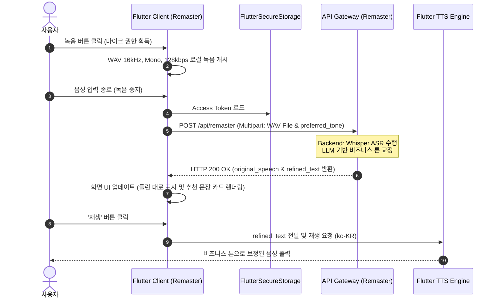
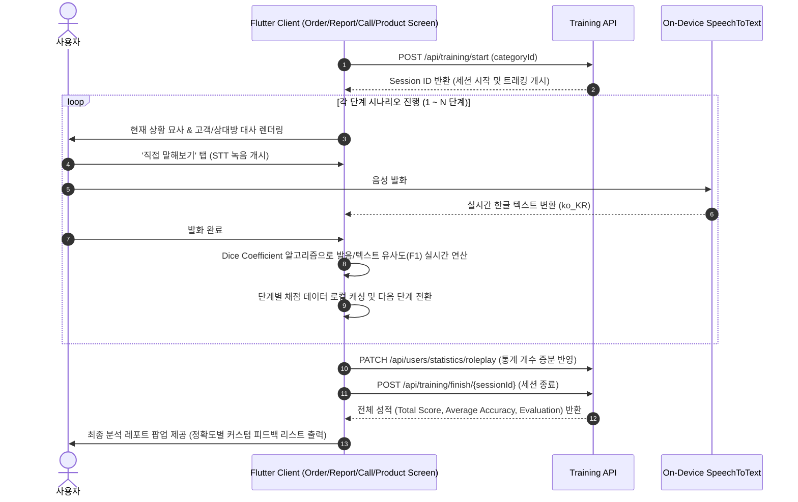

# 🗣️ 말빛 (Malbit) Frontend

> **"더 정확하고 자연스러운 비즈니스 스피치, AI로 말빛을 더하다"**  
> '말빛(Malbit)'은 직무별 비즈니스 상황극 시뮬레이션, AI 실시간 문장 교정(Remaster), 상황별 발화 추천, 그리고 사용자 음성 프로필 학습을 통해 직장 및 비즈니스 현장에서의 의사소통 능력을 극대화할 수 있도록 지원하는 **AI 기반 스피치 트레이닝 모바일 애플리케이션**입니다.

---

## 🏗️ 시스템 아키텍처 및 핵심 워크플로우

본 애플리케이션은 **Feature-First MVVM** 구조를 채택하여 각 모듈(Feature)이 독립적인 Model, Screen(View), Service(API Client)를 가집니다. 이를 통해 기능별 모듈화와 결합도 최소화를 달성했습니다.

### 1. AI 문장 교정 (AI Remaster) 흐름도


### 2. 직무 상황극 시뮬레이션 (Roleplay Session) 흐름도


---

## 🌟 핵심 기술 기능 및 아키텍처 설명

### 1. AI 문장 교정 (AI Remaster) `features/remaster`
*   **음성 수집 스펙**: 하드웨어 마이크 권한을 안전하게 획득하고, `record` 패키지를 이용해 **WAV 컨테이너 포맷(16,000Hz Sample Rate, 단일 채널 Mono, 128,000bps Bit Rate)**의 저지연 고음질 음성을 캡처합니다.
*   **API 통합**: `http.MultipartRequest`를 활용하여 스트리밍 바이트 배열로 음성 파일을 캡처하고, 사용자가 선택한 비즈니스 말씨(Gentle 등) 필드와 함께 `MultipartFile`로 전송합니다.
*   **종단간 피드백 루프**: 백엔드가 전송한 Whisper ASR 텍스트(`original_speech`)와 LLM 문장 교정본(`refined_text`)을 받아 카드 형태로 시각화합니다. 디바이스의 TTS 엔진(`flutter_tts`)과 직접 연동되어 발화 가이드를 기계음 형태로 정확히 전달하며, 시력이 낮은 사용자나 집중 훈련을 위해 텍스트를 크게 띄워주는 `ExpandTextScreens` 뷰 모드를 지원합니다.

### 2. 직무 상황극 시뮬레이션 (Job Roleplay) `features/template`
실제 현장에서 맞닥뜨리는 의사소통 시나리오를 단계별 상호작용 방식으로 연습합니다.
*   **4대 비즈니스 템플릿**:
    *   **주문 받기 (Take Orders ☕)**: 카페/매장 등에서 고객의 음료 선택, 옵션 변경, 품절 대처, 결제 안내 및 주문 최종 확인.
    *   **상품 안내하기 (Product Guide 👜)**: 고객 맞이, 제품 정보 전달, 가격/혜택 고지, 추가 추천 등 능동적 안내 세일즈 스피치.
    *   **업무 보고하기 (Work Report 📑)**: 프로젝트 진행 사항 보고, 문제 상황 공유 및 협업 피드백 전달.
    *   **전화 받기 (Call Support 📞)**: 회사 전화 응대의 기본 포맷팅, 문의 사항 경청 및 담당자 전달 메커니즘 훈련.
*   **세션 라이프사이클 트래킹**: 시작 시 백엔드 `TrainingApi.startSession` 호출을 통해 발급받은 `sessionId`를 컨텍스트 내에서 유지합니다. 시뮬레이션이 종료되면 `finishSession` 요청을 날려 전체 통계를 분석하고 서버의 분석 성과 지표(종합 점수, 평균 정확도, 정성 평가 피드백)를 수집합니다.

### 3. 실시간 상황별 발화 추천 `features/roleplay`
*   **음성 기반 상황 탐지 (Speech-to-Text)**: 사용자가 처한 상황을 입으로 말하면 (`speech_to_text`), 온디바이스 한글 음성 엔진을 통해 상황을 인지합니다.
*   **스마트 침묵 트리거 (Silence Detection)**: 사용자의 말이 끊기면 `Timer`를 기반으로 작동하는 침묵 감지 로직이 개입하여, **3초간 입력이 감지되지 않을 시 자동으로 분석 API(`/api/recommendations/suggest`)로 질의**를 날려 상황 극복을 위한 모범 발화 스크립트와 팁을 제공합니다.
*   **다양한 프리셋**: 빈번히 요구되는 실수 사과, 회의 중 발언, 주문/결제, 첫 인사 등의 상황을 카테고리 태그로 빠르게 탐색할 수 있습니다.

### 4. 개인화된 AI 음성 프로필 학습 `features/voice_settings`
*   **음성 재등록 파이프라인**: 자음 및 모음이 균형 잡힌 6개의 표준 대조용 한국어 문장("나는 오늘 기차를 타고...", "달콤한 빵과 따뜻한...")을 사용자에게 순차 제공합니다.
*   **AI 훈련 다중 파일 전송**: 각 문장별 녹음 데이터를 로컬 임시 폴더(`.wav` 포맷)에 저장했다가, 사용자가 완료 버튼을 누르면 단일 Multipart Request의 `voiceFiles` 스트림 리스트에 실어 `/api/users/voice/re-register`로 일괄 전송함으로써 백엔드 측 개인화 AI 보이스 모델을 튜닝하기 위한 기초 데이터를 형성합니다.

### 5. 일정 조율 및 통계 동기화 `features/home`
*   **고급 캘린더 커스터마이징**: `table_calendar` 라이브러리를 바탕으로, 국문 로케일 적용은 물론 토요일(파란색), 일요일/공휴일(빨간색) 텍스트 스타일을 분리한 수려한 커스텀 UI를 구축했습니다.
*   **공휴일 API 결합**: 로컬 공휴일 정보 조회 서비스(`HolidayService`)를 구축해 국경일/공휴일 정보 데이터를 외부 공공 데이터 API 혹은 백엔드를 거쳐 받아와 달력 상에 기념일 마커 및 기념 메시지를 표시합니다.
*   **Task/Event CRUD**: 일정 등록(`manual`), 수정, 삭제 및 완료 여부 토글 API(`/api/calendar/{taskId}/completion`)를 완벽히 연동해 일일 업무 및 훈련 실적을 달력으로 한눈에 파악하도록 지원합니다.

---

## 🧮 핵심 수학적 알고리즘: Dice Coefficient 기반 텍스트 유사도 계산

사용자가 직무 시나리오에서 제시한 힌트 문장(Ideal Script)을 얼마나 올바르게 발음하고 의미를 맞췄는지 온디바이스에서 1차 평가하기 위해, 형태소 및 단어 토큰의 교집합 비율을 측정하는 **Dice Coefficient (F1-Score)** 기반 유사도 알고리즘을 사용합니다.

### 1. 수학적 공식

단어의 집합 $X$(사용자 인식 텍스트)와 $Y$(힌트 텍스트)의 유사도 $D(X, Y)$는 다음과 같이 정의됩니다.

$$D(X, Y) = \frac{2 \times |X \cap Y|}{|X| + |Y|}$$

이 공식은 정밀도(Precision)와 재현율(Recall)의 조화 평균인 **F1-Score**와 수학적으로 완전히 동일합니다.
*   $\text{Recall} = \frac{|X \cap Y|}{|Y|}$ (힌트 문장에서 사용자가 빠뜨리지 않고 말한 단어 비율)
*   $\text{Precision} = \frac{|X \cap Y|}{|X|}$ (사용자가 발화한 단어 중 힌트 문장과 매칭되는 비율)
*   $\text{F1-Score} = \frac{2 \times \text{Precision} \times \text{Recall}}{\text{Precision} + \text{Recall}} = \frac{2 \times |X \cap Y|}{|X| + |Y|}$

### 2. Dart 소스 코드 구현체 (`OrderScreen` 내 발췌)

```dart
double _similarity(String input, String hint) {
  if (input.trim().isEmpty) return 0.0;
  
  // 1. 한국어 자모, 영어 알파벳, 숫자, 공백을 제외한 문장부호 및 특수문자 제거
  String clean(String s) => s
      .replaceAll(RegExp(r'[^\uAC00-\uD7A3\u1100-\u11FF\u3130-\u318F\s\w]'), '')
      .trim();
      
  // 2. 공백 기준 토큰화 및 고유 단어 세트(Set)화 수행
  final inputWords = clean(input).split(RegExp(r'\s+')).where((w) => w.isNotEmpty).toSet();
  final hintWords = clean(hint).split(RegExp(r'\s+')).where((w) => w.isNotEmpty).toSet();
  
  if (hintWords.isEmpty || inputWords.isEmpty) return 0.0;
  
  // 3. 교집합(Intersection) 연산
  final common = inputWords.intersection(hintWords);
  
  // 4. Recall, Precision 연산
  final recall = common.length / hintWords.length;
  final precision = common.length / inputWords.length;
  
  if (recall + precision == 0) return 0.0;
  
  // 5. 조화평균(F1-Score)을 최종 결과로 도출
  return 2 * recall * precision / (recall + precision);
}
```

---

## 🛠️ 기술 스택 (Tech Stacks)

| 분류 | 기술 및 패키지 | 비고 |
| :--- | :--- | :--- |
| **SDK & 언어** | Dart `^3.9.2`, Flutter SDK | 다중 플랫폼 타겟팅 기반 구조 |
| **보안 스토리지** | `flutter_secure_storage` `^9.0.0` | Android: `EncryptedSharedPreferences`<br/>iOS: `Keychain` 연동 기반 토큰 암호화 저장 |
| **로컬 저장소** | `shared_preferences` `^2.2.2` | 비정형 사용자 가벼운 설정 값 저장 |
| **음성 녹음** | `record` `^6.2.0` | 오디오 인코딩 지원 패키지 (WAV 포맷 최적화) |
| **음성 문자 변환** | `speech_to_text` `^7.0.0` | 디바이스 네이티브 STT 한글 패키지 모듈 |
| **문자 음성 변환** | `flutter_tts` `^4.2.2` | 피드백 구문 읽어주기 기능 |
| **네트워크 통신** | `http` `^1.2.0`, `http_parser` `^4.1.2` | 비동기 JSON REST API 연동 및 파일 업로드 처리 |
| **간편 인증(OAuth)**| `kakao_flutter_sdk_user` `^1.9.0`, `google_sign_in` `^6.2.1` | 소셜 로그인 지원 연동 패키지 |
| **날짜 및 캘린더** | `table_calendar` `^3.2.0`, `intl` `^0.20.2` | 날짜 현지화(ko_KR) 및 캘린더 렌더러 |

---

## 📂 프로젝트 구조 및 디렉토리 레이아웃

코드는 모듈 간 독립성을 보장하고 구조적 유연함을 갖추기 위해 피처 단위로 분리되어 관리됩니다.

```directory
lib/
├── core/
│   └── services/
│       ├── storage.dart         # FlutterSecureStorage 공통 팩토리 구성 설정
│       └── training_api.dart    # 공통 학습 세션(시작/종료) 관련 전역 호출 클라이언트
├── features/
│   ├── auth/
│   │   ├── screens/             # 로그인(Login), 회원가입(SignUp), 비밀번호 재설정
│   │   └── services/            # 이메일/소셜인증 처리 서비스 (auth_service, social_login_service)
│   ├── home/
│   │   ├── models/              # CalendarEvent 모델
│   │   ├── widgets/             # 일정 아이템 위젯, CRUD 바톰시트 다이얼로그
│   │   ├── services/            # calendar_service (일정 CRUD, 완료 토글), holiday_service (공휴일)
│   │   └── screens/             # home_screen (메인 대시보드), calendar_screen (TableCalendar 화면)
│   ├── main_navigation/
│   │   └── screens/             # 메인 하단 네비게이션 셸 콘텍스트 (MainScreen)
│   ├── profile/
│   │   └── screens/             # 사용자 프로필 카드 조회, 비밀번호/이메일 변경, 직무 환경 설정
│   ├── record/
│   │   ├── models/              # 회의록 정보 데이터 전송 객체 (Log, LogDetail)
│   │   ├── services/            # log_service (회의 일지 조회, 개별 디테일 로드, 메모 보존 API)
│   │   └── screens/             # record_screen (오늘/특정날짜 업무 기록 리스트), summary_screen (회의록 상세 및 메모)
│   ├── remaster/
│   │   ├── services/            # remaster_service (음성 업로드 및 보정 텍스트 획득)
│   │   └── screens/             # remaster_screen (AI 문장 교정 메인 인터페이스), expand_text_screens (폰트 줌인 화면)
│   ├── roleplay/
│   │   └── screens/             # roleplay_list_screen (실시간 음성 자동감지 AI 발화 추천기)
│   ├── template/
│   │   └── screens/             # template_screen (직무 상황극 진입로), 4대 직무 상황 모의 화면 (Order, Product, Report, Call)
│   └── voice_settings/
│       └── screens/             # voice_register_screen (사용자 AI 음성 프로필 재등록 엔진)
└── main.dart                    # 앱의 부팅 및 전역 상태(인증 토큰 기반 초기 진로 체크, ko_KR 로케일) 설정 엔트리포인트
```

---

## 🚀 시작하기 및 실행 방법 (Getting Started)

### 사전 요구 사항 (Prerequisites)
*   [Flutter SDK](https://docs.flutter.dev/get-started/install) 설치 (Dart SDK `3.9.2` 및 Flutter `3.29.x` 이상 권장)
*   물리 모바일 디바이스 또는 시뮬레이터 / 에뮬레이터 환경
*   카카오 개발자 콘솔 및 Google Cloud Console에 기기 플랫폼별 패키지명(Android: `com.example.malbit_frontend`, iOS BundleID) 및 OAuth 키 해시 사전 등록 완료 필수.

### 설치 및 설정 (Installation)

1.  **Repository Clone**
    ```bash
    git clone https://github.com/your-username/malbit_frontend.git
    cd malbit_frontend
    ```

2.  **Flutter 패키지 의존성 해결**
    ```bash
    flutter pub get
    ```

3.  **플랫폼별 초기화 검증**
    *   **Android**: `/android/local.properties`에 Flutter SDK 경로가 올바른지 확인합니다.
    *   **iOS**: CocoaPods 환경 설치 및 라이브러리 연동 프로세스를 진행합니다.
        ```bash
        cd ios
        pod install
        cd ..
        ```

4.  **애플리케이션 디버그 모드 실행**
    ```bash
    flutter run
    ```

5.  **Release 빌드 배포본 작성**
    *   **Android (APK)**
        ```bash
        flutter build apk --release
        ```
    *   **iOS (App Bundle)**
        ```bash
        flutter build ipa --release
        ```

---

## 🔒 라이선스 및 유의사항

*   본 프로젝트는 상업적 배포가 불가능하며 외부 릴리즈를 제한하는 `publish_to: 'none'` 속성이 선언되어 있습니다.
*   Kakao SDK 모듈을 사용하는 부분이 포함되어 있으므로 빌드 전 `main.dart` 파일 내의 `nativeAppKey`와 플랫폼 네이티브 수준의 연동 설정(Kakao Scheme)을 확인해 주십시오.
*   마이크 캡처(`record`) 및 실시간 음성인식(`speech_to_text`) 사용을 위해 디바이스 플랫폼 설정 파일(`AndroidManifest.xml`, `Info.plist`)의 권한 획득 스펙 기술을 준수해야 정상적인 런타임 동작을 보장받을 수 있습니다.
